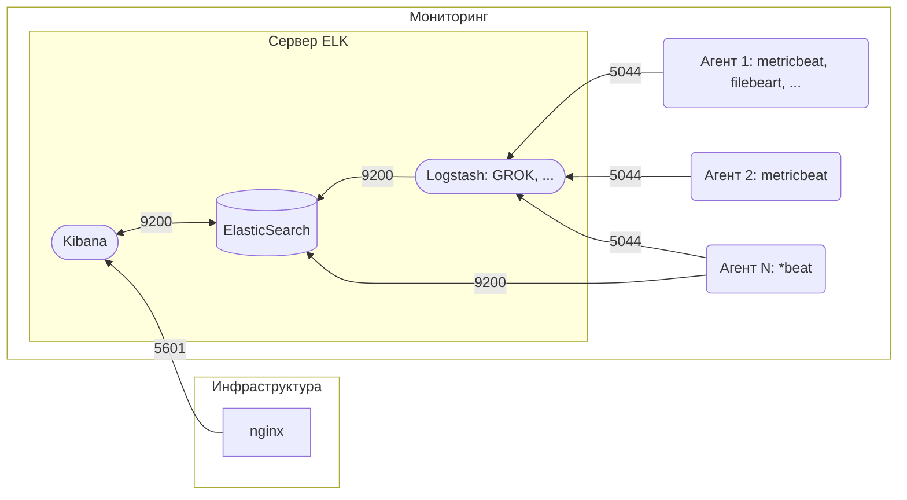

Данный сервис реализует сбор и накопление логов приложений, а также метрик систем, на базе стека ELK.

## Схема работы:



Директории:
*  В директории server находятся сервисы образующие [ELK](https://www.elastic.co/guide/en/elastic-stack-get-started/current/get-started-elastic-stack.html) (Elastic Kibana Logstash)
*  В директории agents находятся агенты [Beat](https://www.elastic.co/guide/index.html#_beats_collect_parse_and_ship)
*  В директории agent-templates находятся шаблонные настройки агентов, например, metricbeat которые не изменяются от 
сервера к серверу

## Установка системы (необходимый минимум для разработки):

1. Установить зависимости:
 - Docker-ce v18.09+
 - Docker-compose v1.23+
 - Git  
 - Make  

2. Авторизуйте машину в gitlab registry
```bash
$ docker login ci.registry
```

3. Выполните команды в рабочей директории
```bash
$ sudo make permission
$ make install
$ sudo make hosts
```

4. После выполнения команд по указанным адресам будут доступны следующие сервисы:

|            Хост             |   Система   | Логин | Пароль |
| --------------------------- | ----------- | ----- | ------ |
|monitoring.kibana:1160       |Kibana       |elastic|elastic |
|monitoring.elasticsearch:1160|Elasticsearch|elastic|elastic |
|monitoring.logstash:1160     |Logstash     |elastic|elastic |

## Настройка системы для запуска на удаленных машинах

1. Необходимо произвести настройку деплоя сервера (docker/server/deploy/master/.env). Внести изменения в настройки
 запуска сервера (docker/server/deploy/master/docker-compose.yml)

2. Произвести настройку агентов в папке agents.
 * создать новую папку в которой необходимо разместить docker-compose.yml (настройки запуска) 
 * имя папки - это названия агента, по которому в дальнейшем можно производить действия

3. Произвести настройки в файле .gitlab-ci.yml.example, переименовав его в .gitlab-ci.yml. API запуска сервера и агентов 
описан в Makefile.

4. Внести изменения в настройки docker (docker/docker.env)

5. Опционально, внести изменения в настройки агентов (docker/agents/agents.env)

6. Опционально, внести изменения в настройки сервера ELK (docker/server/build/*)